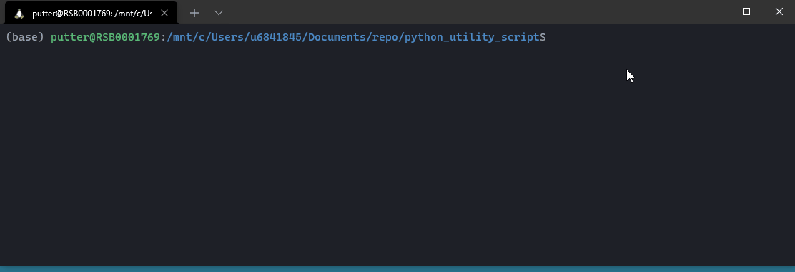

# Explanation for Biology of Reptilia pyPDF downloader

### Motivation
The Gans Collections and Charitable Fund provides multiple books and literature for free online via: https://carlgans.org/publication. One day I was looking for a portion of text in one of the 22 volumes of "Biology of Reptilia." You can view full text content on the browser. However, if one wants to view a subset of pages as a .PDF file, one would have to download the pages individually and then stich them together with some software. This is time consuming so I thought I would find a way to programatically do this. 

The .py script does a few things:
1. It downloads a range (continuos) pages as a single PDF
2. Compile all the single pages PDFs together into one single PDF (with multiple pages)

### Require:
PyPDF2 
tqdm (for progress bar)

### Inputs
- Volume
- Page from*
- Page to*

*Important: You will need the page shown in the URL not the actual page number of the book. Not sure why but the way the book was uploaded to the server makes it so the page number shown on the URL is not the same with the page number of the book. 

Using the command line:

I imagine this script can be adapted so that you can download a bunch of PDFs and stich them together! 

